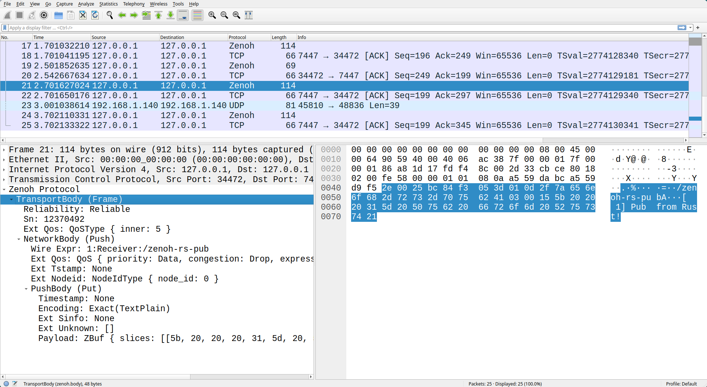

# Zenoh Dissector in Rust!

[Zenoh](http://zenoh.io/) protocol dissector for Wireshark.


> :warning: For Zenoh protocol of version older than 0.10.0, please check the lua plugin [here](https://github.com/ZettaScaleLabs/zenoh-dissector/tree/v0.7.2-rc).

## Installation


### Install dependencies

Zenoh dissector is based on Wireshark EPAN (Enhanced Packet ANalyzer) library.
We need to install Wireshark with its library. Please follow the steps below according to your operating system.

- Linux (Ubuntu)
    ```bash
    sudo apt install -y software-properties-common
    sudo add-apt-repository -y ppa:wireshark-dev/stable
    sudo apt install -y wireshark-dev
    sudo apt install -y --allow-change-held-packages wireshark
    ```

- macOS

    Install Wireshark with [Homebrew](https://brew.sh/).
    ```bash
    brew install --cask wireshark
    ```
    Create a symbolic link for linking the wireshark dynamic library later.
    ```bash
    ln -snf $(find /Applications/Wireshark.app/Contents/Frameworks -name "libwireshark.*.dylib" | tail -n 1) libwireshark.dylib
    export WIRESHARK_LIB_DIR=$(pwd)
    ```

- Windows

    Install Wireshark with [Chocolatey](https://docs.chocolatey.org/en-us/choco/setup#install-with-powershell.exe).
    ```bash
    choco install -y --force --no-progress xsltproc docbook-bundle nsis winflexbison3 cmake wireshark
    ```

### Build the plugin

zenoh-dissector is written in [Rust](https://www.rust-lang.org/).
The toolchain [Rustup](https://rustup.rs) is needed to build the program.

```bash
cargo build --release
```

> (Optional) Choose your custom Wireshark library
> In case you want to build your Wireshark from source and link to this library while building zenoh-dissector.
> We also support this way via setting enviromental variable. Note that users need to ensure this library can be found
> while using it with Wireshark.
>
> - Windows (Powershell and Windows version >= 10)
>     For example, assuming that you have Wireshark installed at 'C:\MyWireshark'. You can tell cargo build to find the Wireshark library you want to link.
>     ```powershell
>     $Env:WIRESHARK_LIB_DIR='C:\MyWireshark'
>     cargo build --release
>     ```
>     Add the folder into the `PATH` so that it can find the dynamic library in runtime.
>     ```powershell
>     [System.Environment]::SetEnvironmentVariable('PATH', [System.Environment]::GetEnvironmentVariable('PATH', 'user')+';C:\MyWireshark', 'user')
>     ```
>
> - Linux (Ubuntu) and macOS
>     ```bash
>     WIRESHARK_LIB_DIR=MyWireshark cargo build --release
>     ```
>     Add the library into  `LD_LIBRARY_PATH` for linux or `DYLD_LIBRARY_PATH` for macOS.

### Move the plugin to Wireshark's pluing folder

- Linux (Ubuntu)
    ```bash
    mkdir -p ~/.local/lib/wireshark/plugins/4.0/epan
    cp ./target/release/libzenoh_dissector.so ~/.local/lib/wireshark/plugins/4.0/epan/libzenoh_dissector.so
    ```

- macOS
    ```bash
    mkdir -p ~/.local/lib/wireshark/plugins/4-0/epan
    cp ./target/release/libzenoh_dissector.dylib ~/.local/lib/wireshark/plugins/4-0/epan/libzenoh_dissector.so
    ```

- Windows
    ```powershell
    $epan_dir = "$Env:APPDATA\Wireshark\plugins\4.0\epan"
    if (-Not (Test-Path $epan_dir)) {
        mkdir -p $epan_dir
    }
    cp .\target\release\zenoh_dissector.dll $epan_dir
    ```


## Usage

### Example: Sample Data

Running Wireshark in TUI version

Linux(Ubuntu) and macOS
```bash
tshark -r ./assets/sample-data.pcap
```

Windows PowerShell
```powershell
& 'C:\Program Files\Wireshark\tshark.exe' -r .\assets\sample-data.pcap
```

Example outpout
```bash
1 0.000000000    127.0.0.1 → 127.0.0.1    TCP 74 60698 → 7447 [SYN] Seq=0 Win=65495 Len=0 MSS=65495 SACK_PERM TSval=1530879817 TSecr=0 WS=128
2 0.000021385    127.0.0.1 → 127.0.0.1    TCP 74 7447 → 60698 [SYN, ACK] Seq=0 Ack=1 Win=65483 Len=0 MSS=65495 SACK_PERM TSval=1530879817 TSecr=1530879817 WS=128
3 0.000042754    127.0.0.1 → 127.0.0.1    TCP 66 60698 → 7447 [ACK] Seq=1 Ack=1 Win=65536 Len=0 TSval=1530879817 TSecr=1530879817
4 0.000342409    127.0.0.1 → 127.0.0.1    Zenoh 88
5 0.000358149    127.0.0.1 → 127.0.0.1    TCP 66 7447 → 60698 [ACK] Seq=1 Ack=23 Win=65536 Len=0 TSval=1530879817 TSecr=1530879817
6 0.000488613    127.0.0.1 → 127.0.0.1    Zenoh 138
7 0.000507245    127.0.0.1 → 127.0.0.1    TCP 66 60698 → 7447 [ACK] Seq=23 Ack=73 Win=65536 Len=0 TSval=1530879817 TSecr=1530879817
8 0.000602256    127.0.0.1 → 127.0.0.1    Zenoh 124
9 0.000731706    127.0.0.1 → 127.0.0.1    Zenoh 74
10 0.001131081    127.0.0.1 → 127.0.0.1    Zenoh 100
11 0.001280084    127.0.0.1 → 127.0.0.1    TCP 66 60698 → 7447 [ACK] Seq=81 Ack=115 Win=65536 Len=0 TSval=1530879818 TSecr=1530879818
12 0.501613967    127.0.0.1 → 127.0.0.1    Zenoh 119
13 0.501667850    127.0.0.1 → 127.0.0.1    Zenoh 70
14 0.501971515    127.0.0.1 → 127.0.0.1    TCP 66 7447 → 60698 [ACK] Seq=115 Ack=138 Win=65536 Len=0 TSval=1530880319 TSecr=1530880319
15 0.502048215    127.0.0.1 → 127.0.0.1    TCP 66 60698 → 7447 [FIN, ACK] Seq=138 Ack=115 Win=65536 Len=0 TSval=1530880319 TSecr=1530880319
16 0.502105376    127.0.0.1 → 127.0.0.1    TCP 66 7447 → 60698 [FIN, ACK] Seq=115 Ack=139 Win=65536 Len=0 TSval=1530880319 TSecr=1530880319
17 0.502135271    127.0.0.1 → 127.0.0.1    TCP 66 60698 → 7447 [ACK] Seq=139 Ack=116 Win=65536 Len=0 TSval=1530880319 TSecr=1530880319
```

### Example: Pub/Sub

Take the pub/sub as a example. One can check [here](https://github.com/eclipse-zenoh/zenoh#how-to-build-it) for the building instructions.



## License

This program is free software: you can redistribute it and/or modify it under the terms of the GNU General Public License as published by the Free Software Foundation, either version 3 of the License, or (at your option) any later version.

This program is distributed in the hope that it will be useful, but WITHOUT ANY WARRANTY; without even the implied warranty of MERCHANTABILITY or FITNESS FOR A PARTICULAR PURPOSE. See the GNU General Public License for more details.

You should have received a copy of the GNU General Public License along with this program. If not, see <https://www.gnu.org/licenses/>.
