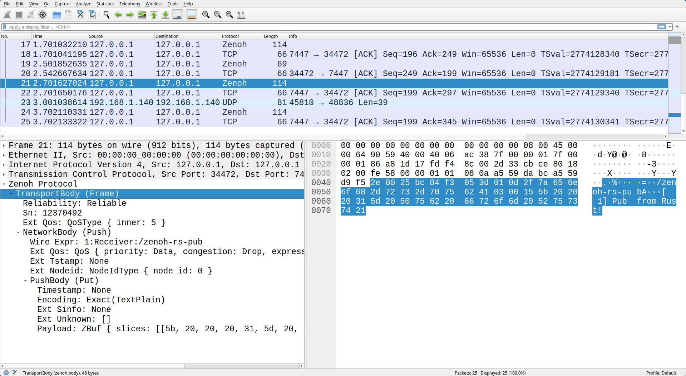

# Zenoh Dissector

[Zenoh](http://zenoh.io/) protocol dissector for Wireshark.

> [!WARNING]
> For Zenoh protocol versions older than 0.10.0, use the Lua plugin [here](https://github.com/eclipse-zenoh/zenoh-dissector/tree/v0.7.2-rc).
>
> The plugin currently requires Wireshark 4.6.

The dissector is split into two components:

- **`zenoh_codec_ffi`** — Rust cdylib with no Wireshark dependency. Contains all decoding logic.
- **`packet-zenoh`** — Standard C Wireshark plugin. Handles field registration, TCP reassembly, and tree building by calling into the Rust cdylib.

Both files must be present in the Wireshark plugin directory.

## Prerequisites

- [Rust toolchain](https://rustup.rs) (for building `zenoh_codec_ffi`)
- CMake 3.15+ (for building `packet-zenoh`)
- Wireshark 4.6 with development headers

### Install Wireshark + headers

- **Linux (Ubuntu)**

    ```bash
    sudo apt install -y software-properties-common
    sudo add-apt-repository -y ppa:wireshark-dev/stable
    sudo apt install -y libwireshark-dev wireshark tshark cmake
    ```

- **macOS**

    ```bash
    brew install wireshark cmake
    ```

- **Windows**

    Install Wireshark via [Chocolatey](https://docs.chocolatey.org/en-us/choco/setup):

    ```powershell
    choco install wireshark -y
    ```

    Then run the helper script to download headers and generate import libraries:

    ```powershell
    .\scripts\build-wireshark-windows.ps1 -WiresharkVersion 4.6.4
    ```

## Build from source

```bash
# Step 1: build the Rust cdylib
cargo build -p zenoh-codec-ffi --release

# Step 2: build the C plugin
cmake -B build -S .
cmake --build build --config Release -j4
```

## Install

Copy both files to the Wireshark personal plugin directory.

- **Linux**

    ```bash
    PLUGIN_DIR=~/.local/lib/wireshark/plugins/4.6/epan
    mkdir -p "$PLUGIN_DIR"
    cp build/packet-zenoh.so "$PLUGIN_DIR/"
    cp target/release/libzenoh_codec_ffi.so "$PLUGIN_DIR/"
    ```

- **macOS**

    ```bash
    PLUGIN_DIR=$(tshark -G folders | awk '/Personal Plugins/{print $NF}')/epan
    mkdir -p "$PLUGIN_DIR"
    cp build/packet-zenoh.so "$PLUGIN_DIR/"
    cp target/release/libzenoh_codec_ffi.dylib "$PLUGIN_DIR/"
    ```

- **Windows**

    ```powershell
    $plugin_dir = "$Env:APPDATA\Wireshark\plugins\4.6\epan"
    New-Item -ItemType Directory -Force -Path $plugin_dir | Out-Null
    Copy-Item build\Release\packet-zenoh.dll $plugin_dir
    Copy-Item target\release\zenoh_codec_ffi.dll $plugin_dir
    # Also place the FFI DLL next to tshark.exe so LoadLibrary can find it
    Copy-Item target\release\zenoh_codec_ffi.dll "C:\Program Files\Wireshark\"
    ```

## Usage

### Sample data

```bash
tshark -r ./assets/sample-data.pcap
```

```
1 0.000000000    127.0.0.1 → 127.0.0.1    TCP 74 60698 → 7447 [SYN] ...
4 0.000342409    127.0.0.1 → 127.0.0.1    Zenoh 88
6 0.000488613    127.0.0.1 → 127.0.0.1    Zenoh 138
8 0.000602256    127.0.0.1 → 127.0.0.1    Zenoh 124
...
```

### Pub/Sub example



### Heuristic dissector

By default the dissector only decodes traffic on port 7447. To decode Zenoh on any port, enable the heuristic dissectors via `Analyze > Enabled Protocols > Zenoh`:

- `zenoh_tcp_heur` — Zenoh over TCP
- `zenoh_udp_heur` — Zenoh over UDP

> [!IMPORTANT]
> When enabled, the dissector attempts to decode all TCP/UDP traffic as Zenoh. This may be performance-intensive and can misidentify non-Zenoh packets.

## License

This program is free software: you can redistribute it and/or modify it under the terms of the GNU General Public License as published by the Free Software Foundation, either version 3 of the License, or (at your option) any later version.

This program is distributed in the hope that it will be useful, but WITHOUT ANY WARRANTY; without even the implied warranty of MERCHANTABILITY or FITNESS FOR A PARTICULAR PURPOSE. See the GNU General Public License for more details.

You should have received a copy of the GNU General Public License along with this program. If not, see <https://www.gnu.org/licenses/>.
